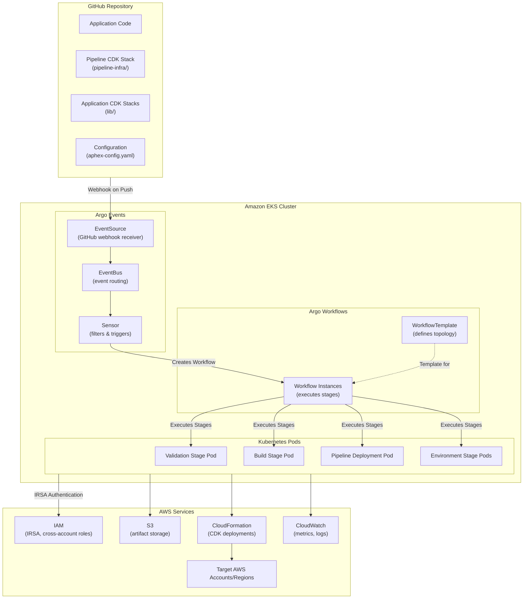
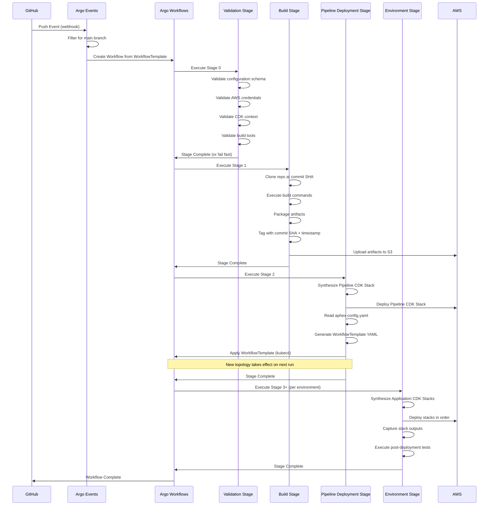
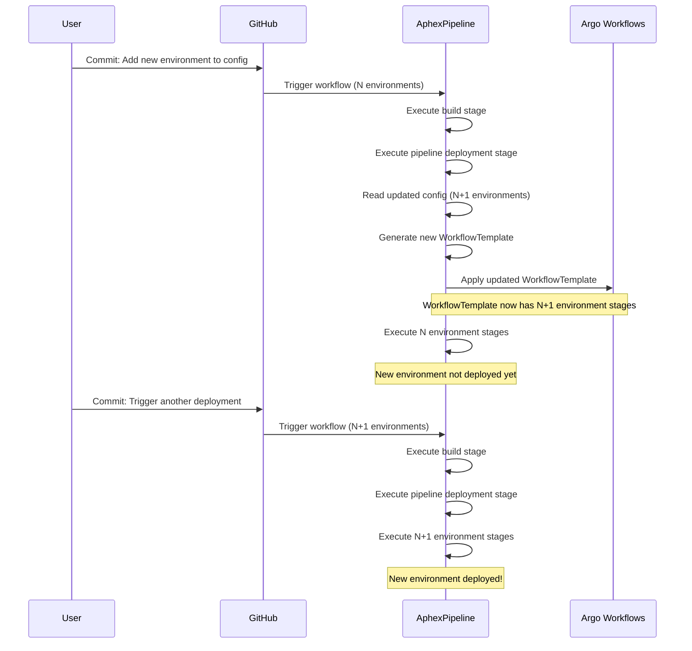
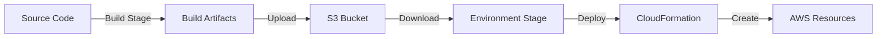
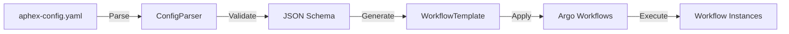
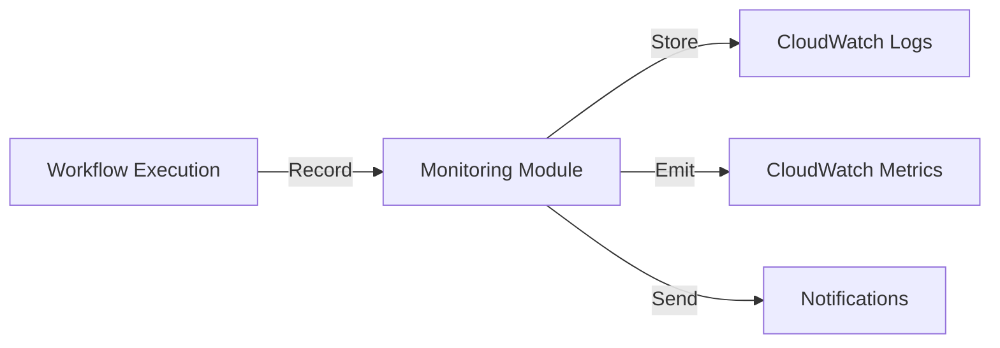
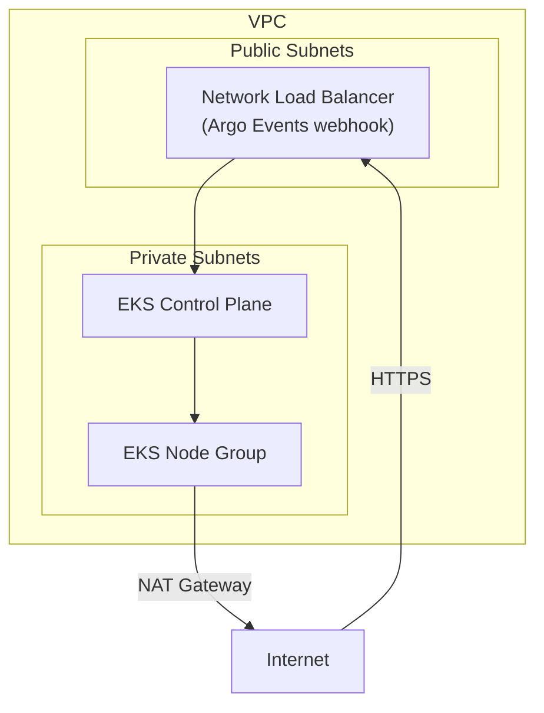
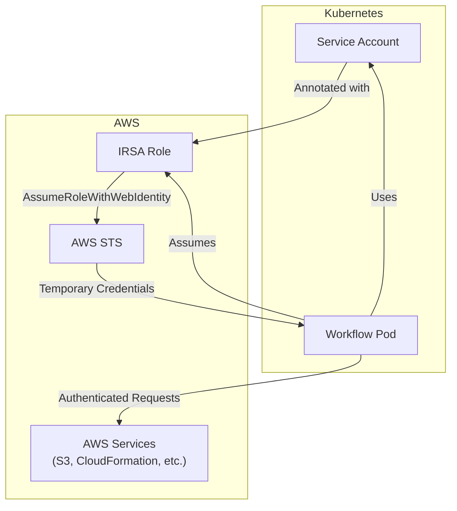
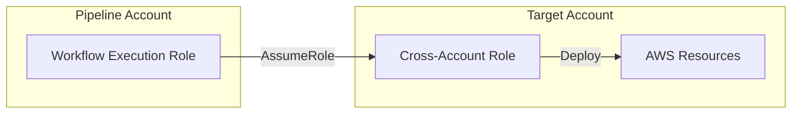

# Architecture

## System Design

AphexPipeline is a self-modifying CDK deployment platform built on Amazon EKS, Argo Workflows, and Argo Events. It operates as a traditional CI/CD pipeline with the unique capability to dynamically alter its own workflow topology based on configuration changes.

### Key Characteristics

- **Self-Modifying**: Updates its own workflow topology based on configuration changes
- **Just-in-Time Synthesis**: Synthesizes CDK stacks at each stage right before deployment
- **Application-Agnostic**: Works with any CDK-based infrastructure without application-specific logic
- **Event-Driven**: Triggered automatically by GitHub webhooks via Argo Events
- **Traditional Pipeline Flow**: Linear progression through stages without declarative state management
- **Infrastructure-as-Code**: The pipeline infrastructure itself is defined using AWS CDK

## High-Level Architecture

## Pipeline Flow

## Self-Modification Flow

## Components

### 1. Pipeline CDK Stack

**Purpose**: Defines the AphexPipeline infrastructure using AWS CDK

**Location**: `pipeline-infra/` directory

**Components**:
- EKS Cluster with managed node groups
- Argo Workflows (installed via Helm)
- Argo Events (installed via Helm)
- IAM Roles (IRSA for workflow execution, cross-account roles)
- S3 Bucket for artifact storage
- VPC and networking infrastructure

**Outputs**:
- Argo Workflows UI URL
- Argo Events webhook URL
- S3 bucket name
- IAM role ARNs

### 2. Argo Events Configuration

**Purpose**: Receives GitHub webhooks and triggers Argo Workflows

**Components**:
- **EventSource**: Listens for GitHub webhook events
- **EventBus**: Routes events between EventSource and Sensors
- **Sensor**: Filters events (e.g., main branch only) and creates Workflow instances

**Configuration Files**:
- `.argo/eventsource-github.yaml`
- `.argo/sensor-aphex-pipeline.yaml`

### 3. WorkflowTemplate Generator

**Purpose**: Generates Argo WorkflowTemplate YAML from aphex-config.yaml

**Location**: `pipeline-scripts/workflow_template_generator.py`

**Process**:
1. Parse aphex-config.yaml
2. Generate validation stage
3. Generate build stage
4. Generate pipeline deployment stage
5. For each environment: generate environment stage with deployment and test steps
6. Apply WorkflowTemplate using kubectl

### 4. Validation Stage

**Purpose**: Validates configuration and environment before workflow execution

**Location**: `pipeline-scripts/validation_stage.py`

**Validations**:
- Configuration schema validation
- AWS credential validation
- CDK context validation
- Build tool validation

**Container Image**: `aphex-pipeline/deployer:latest`

### 5. Build Stage

**Purpose**: Executes user-defined build commands and packages artifacts

**Location**: `pipeline-scripts/build_stage.py`

**Container Image**: `aphex-pipeline/builder:latest` (includes Node.js, Python, AWS CLI, CDK CLI, build tools)

**Process**:
1. Clone repository at specific commit SHA
2. Execute build commands from configuration
3. Package artifacts
4. Tag artifacts with commit SHA and timestamp
5. Upload to S3

### 6. Pipeline Deployment Stage

**Purpose**: Synthesizes and deploys the Pipeline CDK Stack, then updates WorkflowTemplate

**Location**: `pipeline-scripts/pipeline_deployment_stage.py`

**Container Image**: `aphex-pipeline/deployer:latest` (includes CDK CLI, kubectl, Python)

**Process**:
1. Clone repository at commit SHA
2. Synthesize Pipeline CDK Stack
3. Deploy Pipeline CDK Stack (if changes exist)
4. Read aphex-config.yaml
5. Generate updated WorkflowTemplate
6. Apply WorkflowTemplate to Argo

### 7. Environment Stage

**Purpose**: Synthesizes and deploys Application CDK Stacks for a specific environment

**Location**: `pipeline-scripts/environment_deployment_stage.py`

**Container Image**: `aphex-pipeline/deployer:latest`

**Process**:
1. Clone repository at commit SHA
2. Download artifacts from S3
3. Set AWS region and account context
4. Assume cross-account role (if needed)
5. Synthesize each Application CDK Stack just-in-time
6. Deploy stacks in configured order
7. Capture stack outputs
8. Execute post-deployment tests (if configured)

### 8. Test Execution Stage

**Purpose**: Runs user-defined tests after environment deployment

**Location**: `pipeline-scripts/test_execution_stage.py`

**Container Image**: `aphex-pipeline/deployer:latest`

**Process**:
1. Execute test commands from configuration
2. Capture test output and exit codes
3. Store test results
4. Fail workflow if tests fail

### 9. Monitoring and Logging

**Purpose**: Records workflow metadata and emits metrics

**Location**: `pipeline-scripts/monitoring.py`

**Capabilities**:
- Record workflow metadata (ID, commit SHA, timestamps, status)
- Emit CloudWatch metrics for deployments
- Send notifications on workflow completion/failure
- Store workflow and stage metadata

### 10. Configuration Parser

**Purpose**: Parses and validates aphex-config.yaml

**Location**: `pipeline-scripts/config_parser.py`

**Process**:
1. Load YAML file
2. Validate against JSON schema
3. Parse into structured Python objects

### 11. Validation Module

**Purpose**: Provides validation functions for pre-flight checks

**Location**: `pipeline-scripts/validation.py`

**Functions**:
- `validate_aws_credentials()`: Verify AWS credentials are available
- `validate_cdk_context()`: Check required CDK context values
- `validate_build_tools()`: Confirm build tools are available
- `validate_all()`: Run all validations

## Data Flow

### Artifact Flow

### Configuration Flow

### Metadata Flow

## Dependencies

### Upstream Dependencies

**External Services**:
- **GitHub**: Source code repository and webhook provider
- **AWS Services**: EKS, S3, CloudFormation, IAM, CloudWatch
- **Container Registry**: ECR or Docker Hub for container images

**Software Dependencies**:
- **Argo Workflows**: Workflow orchestration (v3.4+)
- **Argo Events**: Event-driven workflow automation (v1.7+)
- **AWS CDK**: Infrastructure as code (v2.0+)
- **Python**: Runtime for pipeline scripts (3.9+)
- **Node.js**: Runtime for CDK and build tools (16+)

### Downstream Dependencies

**Systems that depend on AphexPipeline**:
- Application infrastructure deployed by the pipeline
- Development teams relying on automated deployments
- Monitoring and alerting systems consuming workflow metrics

## Infrastructure

### AWS Services Used

#### Amazon EKS
- **Purpose**: Kubernetes cluster for running Argo Workflows
- **Configuration**: Managed node groups with autoscaling
- **Networking**: VPC with public and private subnets

#### Amazon S3
- **Purpose**: Artifact storage
- **Configuration**: Versioning enabled, encryption at rest
- **Lifecycle**: Automatic cleanup of old artifacts (90 days)

#### AWS IAM
- **Purpose**: Authentication and authorization
- **Components**:
  - IRSA roles for workflow execution
  - Cross-account roles for multi-account deployments
  - Least-privilege policies

#### AWS CloudFormation
- **Purpose**: Deploy CDK stacks
- **Usage**: Managed by CDK CLI in deployment stages

#### Amazon CloudWatch
- **Purpose**: Logging and monitoring
- **Components**:
  - Logs: Workflow execution logs
  - Metrics: Deployment success/failure, duration
  - Alarms: Workflow failures, resource exhaustion

### Container Images

#### Builder Image (`aphex-pipeline/builder:latest`)
- Base: Ubuntu or Amazon Linux
- Includes: Node.js, Python, npm, pip, git, AWS CLI, CDK CLI
- Purpose: Execute build commands

#### Deployer Image (`aphex-pipeline/deployer:latest`)
- Base: Ubuntu or Amazon Linux
- Includes: Python, AWS CLI, CDK CLI, kubectl, YAML libraries
- Purpose: Deploy CDK stacks and manage Kubernetes resources

### Networking

## Security Architecture

### Authentication and Authorization

### Cross-Account Access

## Scalability

### Horizontal Scaling
- EKS node groups autoscale based on pod resource requests
- Multiple workflow instances can run concurrently
- Argo Workflows queues workflows automatically

### Vertical Scaling
- Adjust pod resource requests/limits in WorkflowTemplate
- Upgrade EKS node instance types for more CPU/memory

### Performance Considerations
- Just-in-time synthesis ensures fresh deployments but adds latency
- Artifact caching in S3 reduces build times
- Parallel environment deployments (when independent)

## Disaster Recovery

### Backup Strategy
- **Configuration**: Stored in Git (version controlled)
- **Infrastructure State**: Managed by CloudFormation
- **Artifacts**: Stored in S3 with versioning
- **Workflow History**: CloudWatch Logs (30-day retention)

### Recovery Procedures
- **EKS Cluster Failure**: Redeploy Pipeline CDK Stack
- **Workflow Failure**: Re-trigger workflow for specific commit
- **Artifact Loss**: Rebuild from source code

### RTO/RPO
- **RTO**: ~30 minutes (time to redeploy cluster)
- **RPO**: 0 (configuration in Git, artifacts rebuildable)

## References

**Source Code**:
- Pipeline Infrastructure: `pipeline-infra/`
- Pipeline Scripts: `pipeline-scripts/`
- Argo Configuration: `.argo/`

**Documentation**:
- [Operations Guide](operations.md)
- [API Documentation](api.md)
- [Data Models](data-models.md)
- [Validation Usage](../pipeline-scripts/VALIDATION_USAGE.md)

**External Documentation**:
- [Argo Workflows](https://argoproj.github.io/argo-workflows/)
- [Argo Events](https://argoproj.github.io/argo-events/)
- [AWS CDK](https://docs.aws.amazon.com/cdk/)
- [Amazon EKS](https://docs.aws.amazon.com/eks/)
