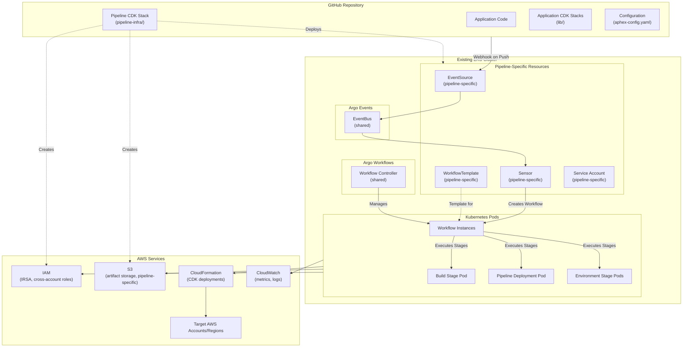

# Design Document

## Overview

AphexPipeline is a self-modifying CDK deployment platform that operates as a traditional CI/CD pipeline with the unique capability to dynamically alter its own workflow topology. Built on Amazon EKS, Argo Workflows, and Argo Events, it provides a generic, reusable infrastructure for deploying any CDK-based application across multiple AWS environments.

The platform follows a just-in-time synthesis approach where CDK stacks are synthesized immediately before deployment at each stage, ensuring that deployments always use the latest code from the current git commit. The pipeline itself is defined as a CDK stack that deploys pipeline-specific resources to an existing EKS cluster, enabling infrastructure-as-code management of the CI/CD pipeline.

### Key Characteristics

- **Cluster-Agnostic**: Runs on an existing EKS cluster with Argo Workflows and Argo Events pre-installed
- **Multi-Tenant**: Multiple pipeline instances can share the same cluster infrastructure
- **Self-Modifying**: Updates its own workflow topology based on configuration changes
- **Just-in-Time Synthesis**: Synthesizes CDK stacks at each stage right before deployment
- **Application-Agnostic**: Works with any CDK-based infrastructure without application-specific logic
- **Event-Driven**: Triggered automatically by GitHub webhooks via Argo Events
- **Traditional Pipeline Flow**: Linear progression through stages without declarative state management
- **Infrastructure-as-Code**: The pipeline resources are defined using AWS CDK

## Architecture

### High-Level Architecture



### Pipeline Flow


## Cluster Requirements

AphexPipeline requires an existing EKS cluster with the following components pre-installed:

### Required Cluster Components

1. **Argo Workflows** (v3.4+)
   - Workflow Controller running
   - Workflow Server (UI) accessible
   - Configured with appropriate RBAC

2. **Argo Events** (v1.7+)
   - Event Controller running
   - EventBus deployed (typically named "default")
   - Configured with appropriate RBAC

3. **Cluster Access**
   - kubectl access configured for CDK deployment
   - IAM permissions to create service accounts with IRSA
   - IAM permissions to create namespaces and apply manifests

### Cluster Setup

The cluster infrastructure is managed by the separate **aphex-cluster** package, which provides:
- EKS cluster with appropriate node groups
- VPC and networking configuration
- Argo Workflows installation via Helm
- Argo Events installation via Helm
- Base RBAC configuration
- Cluster-level monitoring and logging

Multiple AphexPipeline instances can share the same cluster, with isolation provided by:
- Unique namespaces (optional)
- Unique resource names (WorkflowTemplate, EventSource, Sensor)
- Pipeline-specific service accounts and IAM roles
- Pipeline-specific S3 buckets

## Components and Interfaces

### 1. Pipeline CDK Stack

**Purpose**: Defines pipeline-specific resources that are deployed to an existing EKS cluster.

**Location**: `pipeline-infra/` directory in the repository

**Components**:
- **Cluster Reference**: Imports existing EKS cluster by name or ARN
- **Namespace**: Pipeline-specific namespace (optional, can use shared namespace)
- **WorkflowTemplate**: Pipeline-specific workflow definition
- **EventSource**: Pipeline-specific GitHub webhook receiver
- **Sensor**: Pipeline-specific workflow trigger
- **Service Account**: Pipeline-specific service account with IRSA
- **IAM Role**: IRSA role for AWS access, cross-account roles
- **S3 Bucket**: Pipeline-specific artifact storage with encryption and versioning

**Inputs**:
- Cluster reference (optional, defaults to CloudFormation export lookup)
- Cluster export name (optional, defaults to "AphexCluster-ClusterName")
- GitHub repository owner and name (required)
- GitHub token secret name (required)
- Configuration file path (optional, defaults to aphex-config.yaml)

**Cluster Reference Strategy**:
For the MVP, the pipeline uses CloudFormation exports to reference the cluster:
- The aphex-cluster package exports cluster attributes (cluster name, security group, etc.)
- The pipeline imports these values using `Fn.importValue()` with a naming convention
- Default export name: "AphexCluster-ClusterName"
- This approach provides loose coupling while maintaining simplicity

**Outputs**:
- Pipeline-specific webhook URL
- S3 bucket name for artifacts
- IAM role ARN for workflow execution
- WorkflowTemplate name

**Interface**:
```typescript
// pipeline-infra/lib/aphex-pipeline-stack.ts
export interface AphexPipelineStackProps extends cdk.StackProps {
  // Optional: Cluster reference (defaults to CloudFormation export lookup)
  clusterExportName?: string;  // Default: "AphexCluster-ClusterName"
  
  // Required: GitHub configuration
  githubOwner: string;
  githubRepo: string;
  githubTokenSecretName: string;
  
  // Optional: Configuration
  configPath?: string;
  githubBranch?: string;
  pipelineNamespace?: string;
  workflowTemplateName?: string;
  // ... other optional props
}

export class AphexPipelineStack extends cdk.Stack {
  public readonly webhookUrl: string;
  public readonly artifactBucketName: string;
  public readonly workflowExecutionRoleArn: string;
  public readonly workflowTemplateName: string;
}
```

### 2. Argo Events Configuration

**Purpose**: Receives GitHub webhooks and triggers Argo Workflows.

**Components**:
- **EventSource**: Listens for GitHub webhook events
- **EventBus**: Routes events between EventSource and Sensors
- **Sensor**: Filters events and creates Workflow instances

**EventSource Configuration**:
```yaml
apiVersion: argoproj.io/v1alpha1
kind: EventSource
metadata:
  name: github
  namespace: argo-events
spec:
  github:
    aphex-pipeline:
      repositories:
        - owner: <org>
          names:
            - <repo>
      webhook:
        endpoint: /push
        port: "12000"
        method: POST
      events:
        - push
        - pull_request
      apiToken:
        name: github-access
        key: token
```

**Sensor Configuration**:
```yaml
apiVersion: argoproj.io/v1alpha1
kind: Sensor
metadata:
  name: aphex-pipeline-sensor
  namespace: argo-events
spec:
  dependencies:
    - name: github-push
      eventSourceName: github
      eventName: aphex-pipeline
      filters:
        data:
          - path: body.ref
            type: string
            value:
              - "refs/heads/main"
  triggers:
    - template:
        name: aphex-pipeline-trigger
        k8s:
          operation: create
          source:
            resource:
              apiVersion: argoproj.io/v1alpha1
              kind: Workflow
              metadata:
                generateName: aphex-pipeline-
                namespace: argo
              spec:
                workflowTemplateRef:
                  name: aphex-pipeline-template
                arguments:
                  parameters:
                    - name: commit-sha
                      value: "{{body.after}}"
                    - name: branch
                      value: "{{body.ref}}"
                    - name: repo-url
                      value: "{{body.repository.clone_url}}"
```

### 3. WorkflowTemplate Generator

**Purpose**: Generates Argo WorkflowTemplate YAML from aphex-config.yaml.

**Location**: Runs as part of the Pipeline Deployment Stage

**Input**: `aphex-config.yaml` configuration file

**Output**: WorkflowTemplate YAML applied to Argo

**Logic**:
1. Parse aphex-config.yaml
2. Generate build stage
3. Generate pipeline deployment stage
4. For each environment in config:
   - Generate environment stage with CDK synthesis and deployment steps
   - Generate test stage if configured
5. Apply WorkflowTemplate using kubectl

**Interface**:
```python
# pipeline-scripts/generate-workflow-template.py
def generate_workflow_template(config: AphexConfig) -> str:
    """
    Generates Argo WorkflowTemplate YAML from configuration.
    
    Args:
        config: Parsed aphex-config.yaml
        
    Returns:
        WorkflowTemplate YAML string
    """
    pass

def apply_workflow_template(template_yaml: str) -> None:
    """
    Applies WorkflowTemplate to Argo using kubectl.
    
    Args:
        template_yaml: WorkflowTemplate YAML string
    """
    pass
```

### 4. Build Stage

**Purpose**: Executes user-defined build commands and packages artifacts.

**Container Image**: Custom image with build tools (Node.js, Python, AWS CLI, CDK CLI)

**Inputs**:
- Git repository URL
- Commit SHA
- Build commands from aphex-config.yaml

**Outputs**:
- Build artifacts uploaded to S3
- Artifact S3 paths passed to subsequent stages

**Implementation**:
```yaml
- name: build
  inputs:
    parameters:
      - name: commit-sha
      - name: repo-url
      - name: build-commands
  container:
    image: aphex-pipeline/builder:latest
    command: ["/bin/bash"]
    args:
      - -c
      - |
        git clone {{inputs.parameters.repo-url}} /workspace
        cd /workspace
        git checkout {{inputs.parameters.commit-sha}}
        
        # Execute build commands
        {{inputs.parameters.build-commands}}
        
        # Upload artifacts to S3
        aws s3 sync ./artifacts s3://${ARTIFACT_BUCKET}/{{inputs.parameters.commit-sha}}/
  outputs:
    parameters:
      - name: artifact-path
        value: "s3://${ARTIFACT_BUCKET}/{{inputs.parameters.commit-sha}}/"
```

### 5. Pipeline Deployment Stage

**Purpose**: Synthesizes and deploys the Pipeline CDK Stack (pipeline-specific resources only), then updates the WorkflowTemplate.

**Container Image**: Custom image with CDK CLI, kubectl, Python

**Inputs**:
- Git repository URL
- Commit SHA
- Cluster name (from environment variable or workflow parameter)

**Outputs**:
- Updated WorkflowTemplate applied to Argo
- Updated pipeline-specific resources (EventSource, Sensor, Service Account)

**Behavior**:
- Does NOT modify cluster infrastructure (EKS, Argo Workflows, Argo Events)
- Only updates pipeline-specific resources
- Running workflows are not interrupted

**Implementation**:
```yaml
- name: pipeline-deployment
  inputs:
    parameters:
      - name: commit-sha
      - name: repo-url
  container:
    image: aphex-pipeline/deployer:latest
    command: ["/bin/bash"]
    args:
      - -c
      - |
        git clone {{inputs.parameters.repo-url}} /workspace
        cd /workspace
        git checkout {{inputs.parameters.commit-sha}}
        
        # Synthesize Pipeline CDK Stack (pipeline-specific resources only)
        cd pipeline-infra
        cdk synth AphexPipelineStack
        
        # Deploy Pipeline CDK Stack (updates WorkflowTemplate, EventSource, Sensor, etc.)
        # This does NOT modify the cluster itself
        cdk deploy AphexPipelineStack --require-approval never
        
        # The CDK stack handles applying the updated WorkflowTemplate
        # via cluster.addManifest() which uses kubectl internally
        
        echo "Pipeline deployment complete - changes will take effect in next workflow run"
```

### 6. Environment Stage

**Purpose**: Synthesizes and deploys Application CDK Stacks for a specific environment.

**Container Image**: Custom image with CDK CLI, AWS CLI

**Inputs**:
- Git repository URL
- Commit SHA
- Environment configuration (region, account, stacks)
- Artifact path from build stage

**Outputs**:
- Stack outputs for use in tests or subsequent stages

**Implementation**:
```yaml
- name: deploy-environment
  inputs:
    parameters:
      - name: commit-sha
      - name: repo-url
      - name: environment-name
      - name: environment-region
      - name: environment-account
      - name: stacks
      - name: artifact-path
  container:
    image: aphex-pipeline/deployer:latest
    command: ["/bin/bash"]
    args:
      - -c
      - |
        git clone {{inputs.parameters.repo-url}} /workspace
        cd /workspace
        git checkout {{inputs.parameters.commit-sha}}
        
        # Download artifacts from S3
        aws s3 sync {{inputs.parameters.artifact-path}} ./artifacts/
        
        # Set AWS region and account
        export AWS_REGION={{inputs.parameters.environment-region}}
        export AWS_ACCOUNT={{inputs.parameters.environment-account}}
        
        # Synthesize and deploy each stack
        for stack in {{inputs.parameters.stacks}}; do
          echo "Deploying stack: $stack"
          cdk synth $stack
          cdk deploy $stack --require-approval never
          
          # Capture stack outputs
          aws cloudformation describe-stacks \
            --stack-name $stack \
            --query 'Stacks[0].Outputs' \
            > /tmp/${stack}-outputs.json
        done
  outputs:
    parameters:
      - name: stack-outputs
        valueFrom:
          path: /tmp/stack-outputs.json
```

### 7. Configuration Schema

**Purpose**: Defines the structure of aphex-config.yaml.

**Location**: `aphex-config.schema.json`

**Schema**:
```json
{
  "$schema": "http://json-schema.org/draft-07/schema#",
  "type": "object",
  "required": ["version", "build", "environments"],
  "properties": {
    "version": {
      "type": "string",
      "enum": ["1.0"]
    },
    "build": {
      "type": "object",
      "required": ["commands"],
      "properties": {
        "commands": {
          "type": "array",
          "items": { "type": "string" }
        }
      }
    },
    "environments": {
      "type": "array",
      "items": {
        "type": "object",
        "required": ["name", "region", "account", "stacks"],
        "properties": {
          "name": { "type": "string" },
          "region": { "type": "string" },
          "account": { "type": "string" },
          "stacks": {
            "type": "array",
            "items": {
              "type": "object",
              "required": ["name", "path"],
              "properties": {
                "name": { "type": "string" },
                "path": { "type": "string" }
              }
            }
          },
          "tests": {
            "type": "object",
            "properties": {
              "commands": {
                "type": "array",
                "items": { "type": "string" }
              }
            }
          }
        }
      }
    }
  }
}
```

## Data Models

### AphexConfig

**Purpose**: Represents the parsed aphex-config.yaml configuration.

```python
from dataclasses import dataclass
from typing import List, Optional

@dataclass
class BuildConfig:
    commands: List[str]

@dataclass
class StackConfig:
    name: str
    path: str

@dataclass
class TestConfig:
    commands: List[str]

@dataclass
class EnvironmentConfig:
    name: str
    region: str
    account: str
    stacks: List[StackConfig]
    tests: Optional[TestConfig] = None

@dataclass
class AphexConfig:
    version: str
    build: BuildConfig
    environments: List[EnvironmentConfig]
```

### WorkflowMetadata

**Purpose**: Tracks workflow execution metadata for monitoring and auditing.

```python
@dataclass
class WorkflowMetadata:
    workflow_id: str
    commit_sha: str
    branch: str
    triggered_at: datetime
    completed_at: Optional[datetime]
    status: str  # "running", "succeeded", "failed"
    stages: List[StageMetadata]

@dataclass
class StageMetadata:
    stage_name: str
    started_at: datetime
    completed_at: Optional[datetime]
    status: str
    error_message: Optional[str]
```

### ArtifactMetadata

**Purpose**: Tracks build artifacts for traceability.

```python
@dataclass
class ArtifactMetadata:
    commit_sha: str
    timestamp: datetime
    s3_path: str
    artifact_type: str  # "lambda-layer", "binary", "package"
    size_bytes: int
    checksum: str
```


## Correctness Properties

*A property is a characteristic or behavior that should hold true across all valid executions of a system-essentially, a formal statement about what the system should do. Properties serve as the bridge between human-readable specifications and machine-verifiable correctness guarantees.*

### Property 1: Git commit extraction

*For any* GitHub webhook payload, when a workflow is triggered, the system should extract and store both the commit SHA and branch name from the event data.

**Validates: Requirements 1.3**

### Property 2: Repository cloning at specific commit

*For any* commit SHA provided to a workflow, the system should clone the repository at that exact commit, not at HEAD or any other commit.

**Validates: Requirements 1.5**

### Property 3: Build command execution

*For any* list of build commands in the configuration, all commands should be executed in the order specified.

**Validates: Requirements 2.2**

### Property 4: Artifact tagging

*For any* build artifact created, it should be tagged with both the git commit SHA and a timestamp.

**Validates: Requirements 2.3**

### Property 5: Artifact storage and retrieval

*For any* artifact uploaded to S3, it should be retrievable using the same path and have identical contents (round-trip property).

**Validates: Requirements 2.4**

### Property 6: WorkflowTemplate generation from configuration

*For any* configuration with N environments, the generated WorkflowTemplate should contain exactly N environment stages.

**Validates: Requirements 3.5**

### Property 7: Self-modification visibility

*For any* configuration change that adds or removes an environment, the next workflow run after the pipeline deployment stage should reflect that change in its topology.

**Validates: Requirements 3.7, 4.5**

### Property 8: Environment configuration schema compliance

*For any* environment definition in the configuration, it should specify AWS region, account, and at least one CDK stack.

**Validates: Requirements 4.2**

### Property 9: Stack deployment ordering

*For any* environment configuration with an ordered list of stacks, the stacks should be deployed in that exact order.

**Validates: Requirements 4.3, 5.2**

### Property 10: CDK stack synthesis completeness

*For any* environment with N configured stacks, exactly N stacks should be synthesized before deployment.

**Validates: Requirements 5.1**

### Property 11: Stack output capture

*For any* CDK stack that produces outputs, those outputs should be captured and available to subsequent stages.

**Validates: Requirements 5.3**

### Property 12: Test command execution

*For any* list of test commands in an environment configuration, all commands should be executed in the order specified.

**Validates: Requirements 6.1**

### Property 13: Test result capture

*For any* test execution, the results (pass/fail status and logs) should be captured and stored.

**Validates: Requirements 6.3**

### Property 14: Cross-account role assumption

*For any* deployment to an AWS account different from the pipeline account, the correct cross-account IAM role should be assumed.

**Validates: Requirements 7.2**

### Property 15: Credential absence in configuration

*For any* configuration file, it should not contain AWS credentials, API keys, or other secrets.

**Validates: Requirements 7.5**

### Property 16: Workflow metadata recording

*For any* workflow execution, metadata (workflow ID, commit SHA, timestamps, status) should be recorded.

**Validates: Requirements 8.2**

### Property 17: Deployment metrics emission

*For any* CDK stack deployment, CloudWatch metrics should be emitted indicating success or failure.

**Validates: Requirements 8.3**

### Property 18: Notification delivery

*For any* configured notification channel, alerts should be sent when workflows complete or fail.

**Validates: Requirements 8.5**

### Property 19: Configuration schema validation

*For any* configuration file, it should be validated against the JSON schema before workflow execution begins.

**Validates: Requirements 9.1**

### Property 20: AWS credential validation

*For any* AWS account referenced in environment configuration, credentials should be validated before deployment.

**Validates: Requirements 9.3**

### Property 21: CDK context validation

*For any* required CDK context value, it should be validated as present before synthesis.

**Validates: Requirements 9.4**

### Property 22: Build tool validation

*For any* build command specified in configuration, the required tools should be validated as available in the container.

**Validates: Requirements 9.5**

### Property 23: Just-in-time synthesis

*For any* CDK stack deployment, synthesis should occur immediately before deployment, not cached from a previous stage.

**Validates: Requirements 12.1, 12.2**

### Property 24: Stage output propagation

*For any* stage that produces outputs, those outputs should be available as inputs to subsequent stages.

**Validates: Requirements 12.3**

### Property 25: Commit-specific CDK code usage

*For any* CDK synthesis operation, the CDK code should be from the specific git commit being deployed, not from any other commit.

**Validates: Requirements 12.5**

### Property 26: Cluster resource isolation

*For any* pipeline instance deployed to a shared cluster, it should not modify or delete resources belonging to other pipeline instances.

**Validates: Requirements 14.4**

### Property 27: Pipeline destruction cleanup

*For any* pipeline instance that is destroyed, only pipeline-specific resources should be removed, and the cluster should remain intact.

**Validates: Requirements 14.5**

## Error Handling

### Build Stage Failures

**Scenario**: Build commands fail or produce errors

**Handling**:
1. Capture stderr and stdout from failed command
2. Mark workflow as failed
3. Store error logs in S3 for debugging
4. Send notification with error details and workflow link
5. Do not proceed to subsequent stages

**Recovery**: User fixes code, pushes new commit, which triggers new workflow

### CDK Synthesis Failures

**Scenario**: CDK synthesis fails due to invalid CDK code

**Handling**:
1. Capture CDK error output
2. Mark stage as failed
3. Store synthesis logs
4. Send notification with CDK error details
5. Halt workflow

**Recovery**: User fixes CDK code, pushes new commit

### CDK Deployment Failures

**Scenario**: CloudFormation stack deployment fails

**Handling**:
1. Capture CloudFormation error events
2. Mark stage as failed
3. Store CloudFormation events and error details
4. Send notification with stack name and error
5. Do not proceed to subsequent stacks or environments
6. CloudFormation automatic rollback handles stack state

**Recovery**: User investigates CloudFormation error, fixes issue, pushes new commit

### Test Failures

**Scenario**: Post-deployment tests fail

**Handling**:
1. Capture test output and exit code
2. Mark environment stage as failed
3. Store test logs
4. Send notification with test failure details
5. Do not proceed to subsequent environments
6. Deployed infrastructure remains in place for debugging

**Recovery**: User investigates test failure, fixes issue, pushes new commit

### Configuration Validation Failures

**Scenario**: aphex-config.yaml is invalid

**Handling**:
1. Validate configuration at workflow start
2. If invalid, fail immediately before any stages execute
3. Provide clear error message indicating which field is invalid
4. Send notification with validation error
5. Do not execute any stages

**Recovery**: User fixes configuration, pushes new commit

### AWS Credential Failures

**Scenario**: IRSA or cross-account role assumption fails

**Handling**:
1. Detect credential failure during AWS API calls
2. Mark stage as failed
3. Log credential error details (without exposing credentials)
4. Send notification indicating credential issue
5. Halt workflow

**Recovery**: Platform engineer fixes IAM configuration, user retries workflow

### Pipeline Deployment Stage Failures

**Scenario**: Pipeline CDK Stack deployment or WorkflowTemplate generation fails

**Handling**:
1. Capture error details
2. Mark pipeline deployment stage as failed
3. Continue with current WorkflowTemplate (self-modification deferred)
4. Send notification with error details
5. Proceed to environment stages using existing topology

**Recovery**: User fixes pipeline infrastructure code, pushes new commit

### Argo Events Webhook Failures

**Scenario**: GitHub webhook fails to reach Argo Events

**Handling**:
1. GitHub will retry webhook delivery automatically
2. Monitor Argo Events logs for webhook reception
3. If webhook never arrives, user can manually trigger workflow via Argo UI

**Recovery**: Check GitHub webhook configuration, verify EventSource is running

## Testing Strategy

### Unit Testing

**Scope**: Individual components and functions

**Components to Test**:
- Configuration parser and validator
- WorkflowTemplate generator
- Artifact tagging logic
- Metadata recording functions

**Approach**:
- Test configuration parsing with valid and invalid YAML
- Test WorkflowTemplate generation with various environment configurations
- Test artifact path construction and tagging
- Test metadata serialization and deserialization

**Tools**: pytest for Python components, Jest for TypeScript components

### Property-Based Testing

**Scope**: Universal properties that should hold across all inputs

**Library**: Hypothesis for Python, fast-check for TypeScript

**Configuration**: Each property-based test should run a minimum of 100 iterations

**Properties to Test**:

1. **Property 1: Git commit extraction** - Generate random GitHub webhook payloads, verify commit SHA and branch are extracted
2. **Property 3: Build command execution** - Generate random lists of build commands, verify all are executed in order
3. **Property 4: Artifact tagging** - Generate random artifacts, verify all have commit SHA and timestamp tags
4. **Property 5: Artifact storage and retrieval** - Generate random artifacts, upload to S3, download, verify contents match
5. **Property 6: WorkflowTemplate generation** - Generate random configurations with N environments, verify N stages in template
6. **Property 8: Environment configuration schema** - Generate random environment configs, verify required fields present
7. **Property 9: Stack deployment ordering** - Generate random stack orderings, verify deployment follows order
8. **Property 15: Credential absence** - Generate random configuration files, verify no credentials present
9. **Property 19: Configuration schema validation** - Generate random YAML, verify validation catches invalid configs

**Test Tagging**: Each property-based test must include a comment with the format:
```python
# Feature: aphex-pipeline, Property 1: Git commit extraction
```

### Integration Testing

**Scope**: End-to-end workflow execution

**Test Scenarios**:
1. Full pipeline execution with single environment
2. Full pipeline execution with multiple environments
3. Pipeline self-modification when environment added
4. Build failure handling
5. CDK deployment failure handling
6. Test failure handling

**Approach**:
- Deploy test instance of AphexPipeline
- Trigger workflows with test repositories
- Verify expected outcomes
- Clean up test resources

**Tools**: pytest with AWS SDK, kubectl for Kubernetes interactions

### Manual Testing

**Scope**: Bootstrap process and initial setup

**Test Scenarios**:
1. Bootstrap script execution
2. GitHub webhook configuration
3. Argo UI access
4. First workflow trigger

**Approach**:
- Follow bootstrap documentation
- Verify each step completes successfully
- Document any issues or unclear steps

## Deployment and Operations

### Bootstrap Process

**Prerequisites**:
- **Existing EKS cluster** with Argo Workflows and Argo Events installed (via aphex-cluster package)
- AWS account with appropriate permissions
- AWS CLI configured
- kubectl configured for cluster access
- CDK CLI installed
- GitHub repository with admin access

**Steps**:

1. **Verify Cluster Prerequisites**
   ```bash
   # Set cluster name
   export CLUSTER_NAME=<your-cluster-name>
   export AWS_REGION=us-east-1
   
   # Configure kubectl
   aws eks update-kubeconfig --name ${CLUSTER_NAME} --region ${AWS_REGION}
   
   # Verify Argo Workflows is installed
   kubectl get pods -n argo
   kubectl get workflowtemplate -n argo
   
   # Verify Argo Events is installed
   kubectl get pods -n argo-events
   kubectl get eventbus -n argo-events
   ```

2. **Clone Repository**
   ```bash
   git clone <repo-url>
   cd <repo>
   ```

3. **Configure AWS Credentials**
   ```bash
   aws configure
   export AWS_ACCOUNT=$(aws sts get-caller-identity --query Account --output text)
   ```

4. **Bootstrap CDK** (if not already done)
   ```bash
   cdk bootstrap aws://${AWS_ACCOUNT}/${AWS_REGION}
   ```

5. **Create GitHub Token Secret**
   ```bash
   aws secretsmanager create-secret \
     --name github-token \
     --secret-string '{"token":"ghp_your_token_here"}'
   ```

6. **Deploy Pipeline CDK Stack**
   ```bash
   cd pipeline-infra
   npm install
   
   # Update bin/aphex-pipeline.ts with your cluster name and GitHub details
   # Then deploy
   cdk synth AphexPipelineStack
   cdk deploy AphexPipelineStack --require-approval never
   ```

7. **Capture Outputs**
   ```bash
   export WEBHOOK_URL=$(aws cloudformation describe-stacks \
     --stack-name AphexPipelineStack \
     --query 'Stacks[0].Outputs[?OutputKey==`WebhookUrl`].OutputValue' \
     --output text)
   
   export ARTIFACT_BUCKET=$(aws cloudformation describe-stacks \
     --stack-name AphexPipelineStack \
     --query 'Stacks[0].Outputs[?OutputKey==`ArtifactBucketName`].OutputValue' \
     --output text)
   
   export WORKFLOW_TEMPLATE=$(aws cloudformation describe-stacks \
     --stack-name AphexPipelineStack \
     --query 'Stacks[0].Outputs[?OutputKey==`WorkflowTemplateName`].OutputValue' \
     --output text)
   ```

8. **Verify Pipeline Resources**
   ```bash
   # Check WorkflowTemplate was created
   kubectl get workflowtemplate ${WORKFLOW_TEMPLATE} -n argo
   
   # Check EventSource was created
   kubectl get eventsource -n argo-events
   
   # Check Sensor was created
   kubectl get sensor -n argo-events
   
   # Check Service Account was created
   kubectl get serviceaccount -n argo
   ```

9. **Configure GitHub Webhook**
   - Go to GitHub repository settings
   - Add webhook with URL: ${WEBHOOK_URL}
   - Content type: application/json
   - Events: Push events, Pull request events
   - Save webhook

10. **Trigger First Workflow**
    ```bash
    git commit --allow-empty -m "Trigger first workflow"
    git push origin main
    ```

11. **Monitor First Workflow**
    - Get Argo UI URL from cluster (managed by aphex-cluster)
    - Watch workflow execution
    - Verify all stages complete successfully

### Monitoring

**Metrics to Monitor**:
- Workflow success/failure rate
- Workflow duration
- Stage duration breakdown
- CDK deployment success/failure rate
- Build artifact size
- S3 storage usage

**CloudWatch Dashboards**:
- Create dashboard with workflow metrics
- Add alarms for workflow failures
- Monitor EKS cluster health

**Argo Workflows UI**:
- View workflow history
- Inspect failed workflows
- View logs for each stage

### Maintenance

**Regular Tasks**:
- Review failed workflows and investigate root causes
- Clean up old artifacts from S3 (implement lifecycle policy)
- Update Argo Workflows and Argo Events versions
- Review and update IAM policies
- Monitor EKS cluster capacity and scale as needed

**Updating AphexPipeline**:
- Changes to Pipeline CDK Stack are deployed automatically via pipeline deployment stage
- Changes to WorkflowTemplate structure require updating the generator script
- Changes to container images require rebuilding and pushing to ECR

### Troubleshooting

**Workflow Not Triggering**:
1. Check GitHub webhook delivery in repository settings
2. Verify Argo Events EventSource is running: `kubectl get pods -n argo-events`
3. Check EventSource logs: `kubectl logs -n argo-events -l eventsource-name=github`
4. Verify Sensor is running: `kubectl get sensors -n argo-events`
5. Check Sensor logs: `kubectl logs -n argo-events -l sensor-name=aphex-pipeline-sensor`

**Workflow Failing at Build Stage**:
1. Check workflow logs in Argo UI
2. Verify build commands in aphex-config.yaml
3. Verify required tools are in builder container image
4. Check S3 bucket permissions

**Workflow Failing at Pipeline Deployment Stage**:
1. Check CDK synthesis logs
2. Verify Pipeline CDK Stack code is valid
3. Check IAM permissions for CDK deployment
4. Verify kubectl can access cluster

**Workflow Failing at Environment Stage**:
1. Check CDK synthesis logs for Application CDK Stacks
2. Verify Application CDK Stack code is valid
3. Check CloudFormation events for deployment errors
4. Verify cross-account IAM roles if deploying to different account
5. Check CDK context values

**Self-Modification Not Working**:
1. Verify aphex-config.yaml is valid
2. Check pipeline deployment stage logs for WorkflowTemplate generation
3. Verify kubectl apply succeeded
4. Check WorkflowTemplate in cluster: `kubectl get workflowtemplate -n argo`
5. Verify next workflow run uses new template

**Cluster Access Issues**:
1. Verify cluster exists and is accessible: `kubectl get nodes`
2. Check cluster name in Pipeline CDK Stack props
3. Verify IAM permissions for kubectl access
4. Check EKS cluster authentication: `aws eks describe-cluster --name <cluster-name>`
5. Verify Argo Workflows and Argo Events are installed and running

**Multiple Pipelines Interfering**:
1. Verify each pipeline has unique WorkflowTemplate name
2. Verify each pipeline has unique EventSource name
3. Verify each pipeline has unique Sensor name
4. Check for resource name collisions: `kubectl get all -n argo`
5. Consider using separate namespaces for each pipeline

